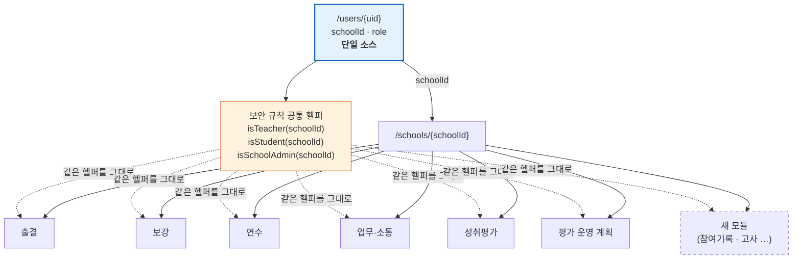

# 스마트교무실 DB 구조 — 이대부고 공유본

> 작성일: 2026-08-19
> 작성자: 홍창기 (선유고등학교)
> 대상: 이대부속고 정보부장 선생님 (자체 서비스 설계·개발 중)
> 배경: [컨설팅기록_이대부고_20260707.md](./컨설팅기록_이대부고_20260707.md) §5-1 — "DB 구조 자문 제공"
> 관련: [컨설팅자료_스마트교무실_타학교도입안내.md](./컨설팅자료_스마트교무실_타학교도입안내.md) (비개발자용 기능 소개)

---

## 0. 이 문서의 성격

**"스마트교무실을 도입하세요"가 아니라, "우리가 통합 구조를 이렇게 잡았고 여기서 이런 대가를 치렀습니다"** 를
공유하는 문서입니다. 이대부고가 앞으로 만들 서비스들(참여기록·생기부 보조·고사 관리 등)을 처음부터
통합을 전제로 설계하실 때, 남의 시행착오를 한 번 훑고 시작하시라는 목적입니다.

그대로 베끼시라는 뜻은 아닙니다. **학생 계정 체계가 다르므로(구글 vs 팀즈) 3장 이후의 원칙만 가져가시고,
사람을 식별하는 키는 이대부고 환경에 맞게 따로 정하셔야 합니다** (6장 참고).

기술 스택: Firebase (Firestore + Auth + Cloud Functions + Storage + Hosting), React 18 + Vite.
문서형 NoSQL 기준의 이야기라 RDB로 가실 경우 3장 원칙만 유효하고 2장 형태는 달라집니다.

---

## 1. 우리가 풀려던 문제 — 이대부고와 같은 문제였습니다

처음부터 통합 DB를 설계한 것이 아니라, **출결 시스템 하나로 시작해서 모듈이 예닐곱 개로 늘어난 결과**입니다.
2026년 4월 첫 배포 이후 출결 → 보강 → 연수 → 공지 → 성취평가제 → 업무 대시보드 순으로 붙었습니다.

모듈이 셋을 넘어가면 반드시 같은 질문이 옵니다.

- 이 사람이 누구인지(교사인지, 어느 학교 소속인지)를 **모듈마다 따로 판정하고 있지 않은가**
- 같은 학생을 모듈 A는 학번으로, 모듈 B는 이메일로 가리키고 있지 않은가
- 새 모듈 하나 붙일 때 인증·권한·학교 분리를 **또 처음부터 짜고 있지 않은가**

이 셋을 한 번에 막는 것이 아래 구조입니다. 새 모듈의 초기 비용을 "프레임 구축 수일" 수준으로
낮추는 것이 목적이고, 실제로 최근 모듈(교수학습 및 평가 운영 계획, 2026-08-18)은 그 정도에 붙었습니다.

---

## 2. 한 장 요약 — 전체 구조

```
/users/{uid}                     ← 계정. 학교 밖에 있는 유일한 사람 데이터
/studentRegistrations/{email}    ← 학생 자동 등록 색인
/schoolDomains/{domain}          ← 도메인 → 학교 매핑 (가입 시 학교 추천용)
/auditLogs/{logId}

/schools/{schoolId}              ← 학교 데이터는 예외 없이 이 아래로 파티션
  ├─ 구성원   students · studentGroups · preApproved · presence
  ├─ 배정     teacherAssignments · teacherSubjects · officeLayouts   (학년도 단위)
  ├─ 교육과정 subjects (입학년도 단위) · courses
  ├─ 출결     events/{id}/attendanceLogs
  ├─ 보강     coverRequests
  ├─ 연수     trainings/{id}/signatures
  ├─ 업무     requests/{id}/{completions,comments} · channels · personalNotices
  ├─ 성취평가 asaSubjects · asaSubmissions · asaResults · …
  └─ 평가계획 evaluationPlans · evaluationPlanManagers
```

현재 최상위 5개(위 4개 + 키오스크 페어링 코드) + 학교 하위 30여 개 컬렉션. **모듈이 늘어난 것은 오른쪽 가지뿐이고,
왼쪽 축(`/users` + `/schools/{schoolId}`)은 처음부터 지금까지 바뀌지 않았습니다.**



**요점은 점선입니다.** 새 모듈을 붙일 때 인증·권한·학교 분리를 새로 짜지 않고,
이미 6개 모듈에서 검증된 헬퍼 3개를 그대로 재사용합니다.

---

## 3. 설계 원칙 5가지

### 3-1. 학교 파티션 — 학교 스코프 데이터는 예외 없이 `/schools/{schoolId}/...`

멀티테넌트를 나중에 붙이면 거의 반드시 실패합니다. 컬렉션마다 `schoolId` 필드를 넣고
쿼리에서 거르는 방식은 **필터 한 번 빠뜨리면 남의 학교 데이터가 새는데, 그 사고가 조용합니다.**

경로 자체를 학교로 나누면 보안 규칙이 `match /schools/{schoolId}/...` 안에서 `schoolId`를
변수로 받으므로, 규칙을 쓰는 순간 학교 분리가 강제됩니다. 필터를 빠뜨릴 자리가 없습니다.

> 지금 학교가 하나뿐이더라도 이 형태로 시작하시길 권합니다.
> 비용은 경로가 두 단계 길어지는 것뿐이고, 나중에 옮기는 비용은 전면 마이그레이션입니다.

### 3-2. 계정만 학교 밖에 — `/users/{uid}` 하나가 `schoolId`·`role`의 단일 소스

로그인 시점에는 아직 소속이 없습니다. 그래서 계정 컬렉션만 최상위에 둡니다.

중요한 것은 **"소속과 역할이 여기 한 곳에만 있다"** 입니다. 모듈이 각자 교사 명단을 들고 있으면
인사이동 때 여섯 군데를 고쳐야 하고, 반드시 한 군데를 빠뜨립니다.

- `role`: `pending` / `teacher` / `admin` / `school_admin` / `principal` / `student` / `rejected`
- `schoolId`: 소속 학교

가입 흐름은 **도메인으로 학교를 추천 → 수동 가입 신청 → 관리자 승인** 입니다.
(설계 초안에는 "도메인으로 자동 배정"이 있었지만, 자동 배정은 오배정 시 되돌릴 사람이 없어서 뺐습니다.)

### 3-3. 권한 판정은 공통 헬퍼 한 벌 — 모듈이 늘어도 규칙은 늘지 않는다

Firestore 보안 규칙 최상단에 헬퍼를 두고, 30여 개 컬렉션이 전부 이것만 씁니다.

```javascript
function isTeacher(schoolId) {
  return isSignedIn()
    && getUserData().role in ['teacher', 'admin', 'school_admin', 'principal']
    && getUserData().schoolId == schoolId;
}
```

새 컬렉션의 규칙은 대개 두 줄로 끝납니다.

```javascript
match /새모듈/{docId} {
  allow read:  if isSuperAdmin() || isTeacher(schoolId);
  allow write: if isSuperAdmin() || isSchoolAdmin(schoolId);
}
```

> 여기서 얻는 실질적 이득은 **"권한 로직을 한 곳에서만 검토하면 된다"** 입니다.
> 모듈마다 조건을 손으로 쓰면, 여섯 번째 모듈쯤에서 조건 하나가 미묘하게 달라지고
> 그것이 구멍이 됩니다.

### 3-4. 경로와 문서 ID는 주석이 아니라 코드로 강제한다

저희가 실제로 겪은 사고입니다. 사무실 자리배치 문서 ID 규칙이 `{year}__{office}`(밑줄 2개)인데
어떤 코드가 `{year}_{office}`(1개)로 조회해서, **데이터가 있는데 없는 것처럼 보이는** 버그가 났습니다.
주석에만 규칙이 있으면 이런 일이 반드시 납니다.

그래서 경로·문서 ID 규칙을 파일 하나(`apps/shared/lib/schema.js`)로 모으고,
문자열 조합을 금지했습니다.

```javascript
export const COL = {
  TEACHER_ASSIGNMENTS: 'teacherAssignments',
  SUBJECTS: 'subjects',
  REQUESTS: 'requests',
  // …
}

export function schoolPath(schoolId, ...segments) {
  return [SCHOOLS, schoolId, ...segments]
}

export function officeLayoutId(year, office) {
  return `${year}__${office.replace(/\//g, '_')}`   // 밑줄 2개
}

// 호출부
collection(db, ...schoolPath(schoolId, COL.SUBJECTS))
```

**바이브 코딩 환경에서는 이게 특히 중요합니다.** AI는 주변 코드를 보고 그럴듯하게 문자열을
조합하는데, 규칙이 코드로 없으면 매번 조금씩 다르게 만들어냅니다. 함수로 두면 AI도 그 함수를 씁니다.

### 3-5. 컬렉션을 늘리기 전에, 필드로 표현되는지 먼저 본다

가장 최근에 배운 것이고, 아마 가장 실전적인 원칙입니다.

학교 업무 글은 크게 둘입니다 — **안내**(단축수업 공지, 읽으면 끝)와 **요청**(원안 제출, 사람마다 했다/안 했다가 생김).
처음엔 컬렉션을 나누려 했지만, 필요한 것이 제목·내용·자료·대상까지 똑같고
다른 것은 "완료 확인을 받느냐" 하나뿐이었습니다.

→ 컬렉션을 나누지 않고 `kind: 'notice' | 'request'` 필드 하나로 구분했습니다.
작성 화면·목록·상세를 한 벌만 유지하면 되고, 쓰는 사람도 "공지냐 요청이냐"가 아니라
"이거 확인받아야 하나"만 판단하면 됩니다.

같은 판단으로 **채널**(업무 글이 모이는 곳)도 별도 글 컬렉션 없이
`requests.channelId`라는 **이름표**로 구현했습니다.

> 반대로, **나누는 것이 맞았던 경우**도 기록해 둡니다. 저희는 "과목"이라는 이름의 컬렉션이 셋입니다.
> | 컬렉션 | 정체 | 누가 만드나 |
> |---|---|---|
> | `subjects` | 학교 교육과정 편제표의 **정본** | 학교 관리자만 |
> | `courses` | 교사가 출결 이벤트 묶으려고 만든 **자유 입력 라벨** | 아무 교사나 |
> | `asaSubjects` | 성취평가제의 **제출 단위** | 학교 관리자 |
>
> 이름이 같다고 합치면, **쓰기 권한이 교사 전체인 데이터와 관리자 전용인 데이터가 한 컬렉션에 섞입니다.**
> 판단 기준은 이름이 아니라 **소유자·수명·정확도 요구**입니다. 셋 중 둘의 그것이 다르면 나눕니다.

---

## 4. 새 서비스를 붙일 때 — 재사용되는 것과 새로 만드는 것

| | 항목 |
|---|---|
| **그대로 재사용** | 로그인·계정 생성 흐름, `schoolId` 판정, 보안 규칙 헬퍼 3개, 학교 파티션 경로, 파일 업로드(Storage 규칙·첨부 유틸), 대상 지정 엔진, 관리자 화면 셸 |
| **새로 만드는 것** | 컬렉션 1~2개 + 규칙 2~4줄, 화면, 그 모듈 고유의 필드 |

실제 사례 — **교수학습 및 평가 운영 계획**(2026-08-18): hwpx 파일을 올리면 파싱해서
반영비율·성적산출방법을 뽑고, 교사가 검토·확정하면 교직원 관리(담당교과·과목배정)에 자동 반영됩니다.
새로 만든 것은 컬렉션 2개(`evaluationPlans`, `evaluationPlanManagers`)와 파서·화면뿐이고,
**"누가 볼 수 있는가"는 기존 헬퍼로 끝났습니다.**

### 대상 지정 엔진 — 모듈 간에 가장 많이 재사용된 부분

"2학년 담임 전원", "국어과 교사", "부장단"을 뽑는 일은 업무 요청·채널·공지에서 전부 같은 문제였습니다.
그래서 조건 규칙을 한 벌만 만들어 공유합니다.

```javascript
targetRule = {
  conditions: [{ type: 'department', values: ['교무부'] }],  // 부서·교과·직급·수업학년
  includeUids: [], excludeUids: []
}
```

이대부고에서도 참여기록·고사 서비스가 "누구에게 보낼 것인가"를 각자 구현하실 가능성이 큰데,
**이 부분은 처음부터 공용으로 빼두시길 권합니다.**

---

## 5. 값비싸게 배운 것 — 그대로 물려받으실 만한 7가지

### 5-1. 문서 ID를 값으로 쓰지 말 것 ★ 가장 크게 데인 곳

학생 문서 ID를 **학번 5자리**로 쓰고 있었습니다. 편했습니다 — 학번만 알면 바로 조회되니까요.

그러다 Google Workspace 계정 동기화를 붙이면서 **문서 ID를 Workspace User ID(21자리)로 옮겼습니다**
(2026-07-30, 학생 620명 중 598명 성공 · 나머지는 Workspace 계정을 못 찾아 학번 유지). 학번은 학년이 바뀌면 바뀌는데 그걸 키로 쓰고 있었으니
언젠가는 해야 할 일이었습니다.

**그 뒤로 "문서 ID가 학번"이라고 가정한 코드가 몇 주에 걸쳐 하나씩 터졌습니다.**

| 시점 | 증상 |
|---|---|
| 08-10 | 키오스크에서 학번으로 학생을 못 찾음 |
| 08-14 | 학생 QR 체크인이 "명단에 없는 학생"으로 거부됨 — **보안 규칙**이 문서 ID와 학번을 비교하고 있었다 |

마지막 하나가 특히 아팠습니다. 규칙 파일은 화면 코드를 훑을 때 눈에 안 들어옵니다.

> **교훈**: 조회 키가 필요하면 문서 ID로 쓰지 말고 **같은 값을 필드로도 저장**하고,
> 규칙과 쿼리는 언제나 필드를 봅니다. 문서 ID는 "그냥 유일한 식별자"로만 취급합니다.

### 5-2. 사람을 표시값으로 잇지 말 것 — 이름·이메일은 키가 아니다

성취평가제 모듈은 담당 교사를 **이메일 문자열 배열**로 들고 있었습니다.
나머지 시스템은 전부 Firebase Auth uid로 사람을 식별하는데 말이죠.

이메일 매칭은 **계정 이메일이 바뀌거나 대소문자가 다르면 아무 에러 없이 조용히 끊깁니다.**
담당 교사가 자기 제출물에 못 들어가는데, 로그에는 아무것도 안 남습니다.

전환은 **비파괴적으로** 했습니다 — 기존 `teacherEmails`를 지우지 않고 `teacherUids`를 함께 저장,
읽을 때는 uid 우선·없으면 이메일 폴백, 담당 여부 판정은 **둘의 합집합**.
마이그레이션 도중 한쪽만 최신인 문서 때문에 담당 교사가 잠기는 일을 막기 위해서입니다.

> **교훈**: 사람·사물을 가리키는 키는 **불변 ID**여야 합니다. 이름·이메일·학번은 표시용입니다.
> 이미 표시값으로 이어놨다면, 지우지 말고 **불변 키를 옆에 추가하고 합집합으로 판정**하며 넘어갑니다.

### 5-3. 이름은 스냅샷으로 함께 저장한다 (정규화의 예외)

원칙 5-2와 반대로 보이지만 짝입니다. uid로 잇되, **그 시점의 이름을 함께 박아둡니다.**

```javascript
targetUids:  ['uid_a', 'uid_b'],
targetNames: ['홍길동', '김철수'],   // 발송 시점 스냅샷
```

계정이 삭제돼도 "누구에게 보낸 요청이었는지"가 남아야 하고, 목록을 그릴 때마다
사람 수만큼 계정 문서를 읽지 않아도 됩니다.

> 판정은 ID로, 표시는 스냅샷으로. 둘의 역할을 섞지 않는 것이 요점입니다.

### 5-4. 대상 명단은 "발송 시점"에 고정한다

업무 요청의 대상을 조건("2학년 담임")으로만 저장하고 매번 재계산하면,
**마감이 지난 요청에 인사이동으로 사람이 조용히 추가되어, 받은 적도 없는데 미완료로 찍힙니다.**

그래서 조건(`targetRule`)은 감사·재계산용으로 남기되, 실제 대상은 발송 시점 명단(`targetUids`)으로
고정합니다. 재계산은 작성자가 명시적으로 눌러야 일어납니다.

> **교훈**: "동적 조건"이 항상 옳지 않습니다. **시간이 지나도 의미가 안 변해야 하는 데이터는 박제**합니다.

### 5-5. 보안 규칙은 문서 단위가 아니라 필드 단위로 잠근다

요청 문서에는 완료자 목록(`completedUids`)이 있습니다. 대상 교사가 **자기 완료를 체크**하려면
이 문서를 update할 수 있어야 하는데, 문서 단위로 열면 **제목·마감일·대상 명단까지 고칠 수 있게 됩니다.**

```javascript
// 대상 교사: completedUids·updatedAt만, 그 안에서도 자기 uid만
allow update: if isTeacher(schoolId)
  && request.auth.uid in resource.data.targetUids
  && request.resource.data.diff(resource.data).affectedKeys()
       .hasOnly(['completedUids', 'updatedAt'])
  && selfOnlyUidChange('completedUids');
```

`selfOnlyUidChange()`는 "배열에서 움직인 값이 본인뿐인가"를 봅니다.
이게 없으면 대상 교사가 **남의 완료를 대신 체크**할 수 있습니다.

같은 모양이 세 군데에서 재사용됩니다 — 요청 완료 체크, 채널 나가기(`leftUids`), 쪽지 읽음.

> 부수 효과 하나: **채널 "나가기"를 `memberUids`에서 자기를 빼는 방식으로 만들면,
> 나갈 수 있는 사람은 남을 내보낼 수도 있게 됩니다.** 그래서 `leftUids`를 별도 필드로 뒀습니다.
> **필드를 어떻게 나누느냐가 곧 권한 설계**라는 것을 여기서 배웠습니다.

### 5-6. 1:1 데이터를 배열로 담지 말 것

쪽지(교사 간 1:1)를 여러 명에게 보낼 때, 한 문서에 수신자 배열 + 읽음 배열이 단순해 보였습니다.

문제는 두 가지였습니다. ① 읽음 하나를 바꿀 때마다 **남의 읽음까지 든 문서를 통째로** 쓰게 되고,
② 수신자 전원이 **서로의 쪽지 내용과 읽음 상태를 볼 수 있게 됩니다** — 1:1이라는 전제가 깨집니다.

→ **받는 사람 한 명당 문서 하나**를 만들고 `batchId`로 묶었습니다.
받은함은 그대로 1:1이고, 보낸함에서만 묶어 "5명에게 · 3명 읽음"으로 보여줍니다.

> **교훈**: 문서 경계는 **"누가 이걸 통째로 볼 수 있어야 하는가"** 로 정합니다.
> 쓰기 편의로 정하면 열람 범위가 따라 넓어집니다.

### 5-7. Storage 다운로드 URL은 보안 규칙을 우회한다

Firebase Storage에서 `getDownloadURL()`이 돌려주는 `?alt=media&token=...` 주소는
**규칙과 무관하게 링크를 가진 사람이면 누구나 열립니다.** 규칙은 SDK 접근과 목록 열람만 막습니다.

그래서 **고사 원안처럼 유출되면 안 되는 파일은 아예 올리지 않는다**를 원칙으로 두고 문서에 명시했습니다.
이대부고가 고사 서비스를 만드신다면 이 지점을 처음부터 설계에 반영하셔야 합니다.

> 관련해서 하나 더 — Storage 규칙 안의 `firestore.get()`이 저희 프로젝트에서 동작하지 않아
> (IAM 권한을 줘도 동일) 업로드가 전부 거부된 적이 있습니다. 결국 **소속·직군을 인증 토큰
> (Custom Claims)에 심어** 규칙이 외부를 읽지 않게 했습니다. 교차 서비스 의존이 사라지고
> 업로드마다 나던 읽기 비용도 없어졌습니다.
> 단, **클레임이 갱신돼도 이미 발급된 토큰에는 최대 1시간까지 반영되지 않습니다**(`getIdToken(true)` 필요).

---

## 6. 이대부고 환경에서 다시 정하셔야 할 것

### 6-1. 학생 식별 방식 — 가장 큰 차이

스마트교무실의 학생 인증은 **구글 OAuth + 이메일 로컬파트 9자리 숫자 패턴**에 의존합니다.
이대부고는 학생 계정이 팀즈 중심이므로(컨설팅기록 §1), **이 전제가 그대로 적용되지 않습니다.**

데이터 스키마보다 이 부분이 실제로는 더 큰 갈림길입니다. 정하셔야 할 것:

- 학생을 가리키는 **불변 키**를 무엇으로 둘 것인가 (Microsoft Entra ID의 objectId? 학교 자체 발급 ID?)
- 학번은 학년이 바뀌면 변하므로 **키가 아니라 필드**여야 한다는 점 (→ 5-1)
- 학생이 로그인 없이 쓰는 화면(QR 체크인 등)이 필요한가 — 필요하다면 그 경로의 권한을 따로 설계

> 다만 **원칙 5-1은 어느 쪽이든 같습니다** — 문서 ID를 학번으로 두면 저희가 겪은 마이그레이션을
> 몇 년 뒤에 똑같이 하시게 됩니다.

### 6-2. 학년도(`year`) vs 입학년도(`entryYear`) — 학교 시스템 공통 함정

이름이 비슷해서 섞어 쓰기 쉬운데 완전히 다른 값입니다.

| | `year` (학년도) | `entryYear` (입학년도 = 학번) |
|---|---|---|
| 뜻 | 교육과정이 운영되는 해 (3월~다음 해 2월) | 학생이 입학한 해. **코호트에 고정, 안 바뀜** |
| 붙는 데이터 | "올해는 이렇게 운영한다" — 교원 배정, 자리배치 | "이 코호트의 교육과정은 이렇다" — 과목 편제표 |

교육과정 편제는 입학 코호트 단위로 고정되므로, **과목 카탈로그는 학년도가 아니라 입학년도로 스코프**합니다.
학년도로 두면 학년이 올라갈 때마다 편제표를 복제해야 하고 어느 쪽이 정본인지 흐려집니다.

변환 함수를 코드로 두고 계산을 손으로 하지 않습니다 (`entryYearFor(2026, 3) === 2024`).

### 6-3. 보건실 출입 시스템 (컨설팅기록 §3-4)

건강정보는 위 원칙들과 별개로 **보관 기간·접근 권한·법적 근거**를 먼저 정하셔야 합니다.
스마트교무실에는 대응하는 선례가 없어 자문드릴 것이 없습니다.
다만 5-5(필드 단위 권한)와 5-7(Storage URL 우회)은 그대로 유효합니다.

---

## 7. 더 보실 것

| 문서 | 내용 |
|---|---|
| [`DB_STRUCTURE.md`](../DB_STRUCTURE.md) | **전체 DB 구조 상세** — 컬렉션별 전 필드·타입·권한·인덱스, 문서 ID 규칙, 마이그레이션 이력. 필드 하나까지 실제 read/write 코드에서 확인한 값만 적는 것을 원칙으로 함 |
| [`firestore.rules`](../firestore.rules) | 보안 규칙 전문 (헬퍼 함수 + 컬렉션별 규칙, 판단 근거를 주석으로 남김) |
| [`apps/shared/lib/schema.js`](../apps/shared/lib/schema.js) | 경로·문서 ID 규칙의 단일 소스 |
| [`apps/shared/lib/targeting.js`](../apps/shared/lib/targeting.js) | 대상 지정 조건 엔진 |
| [`apps/shared/lib/workRequests.js`](../apps/shared/lib/workRequests.js) | 안내/요청을 한 컬렉션에 담은 이유와 완료 집계 |
| [`CLAUDE.md`](../CLAUDE.md) | 프로젝트 개요 (AI 협업용 지침 겸용) |

저장소 협업 멤버로 초청드리는 방안을 검토 중입니다(컨설팅기록 §5-3).
초청이 성사되면 위 파일들을 직접 보시면서 논의하는 편이 빠를 것 같습니다.

---

## 8. 한 줄 요약

**모듈을 늘리기 전에 축을 먼저 세우세요.** 계정 하나(`/users`)와 학교 파티션 하나(`/schools/{schoolId}`),
그리고 권한 헬퍼 세 개. 이 셋만 고정되면 나머지는 가지를 치는 일이고, 새 서비스의 초기 비용이
"인증·권한부터 다시"에서 "컬렉션 하나와 규칙 두 줄"로 내려갑니다.

그리고 **사람을 가리키는 키는 처음부터 불변 ID로** 두세요.
저희가 이 문서에서 가장 길게 쓴 5-1과 5-2가, 나중에 고치느라 가장 오래 걸린 부분입니다.

---

*문의: 홍창기 (선유고등학교) · 이 문서는 2026-08-19 기준 코드에 대조하여 작성되었습니다.*
