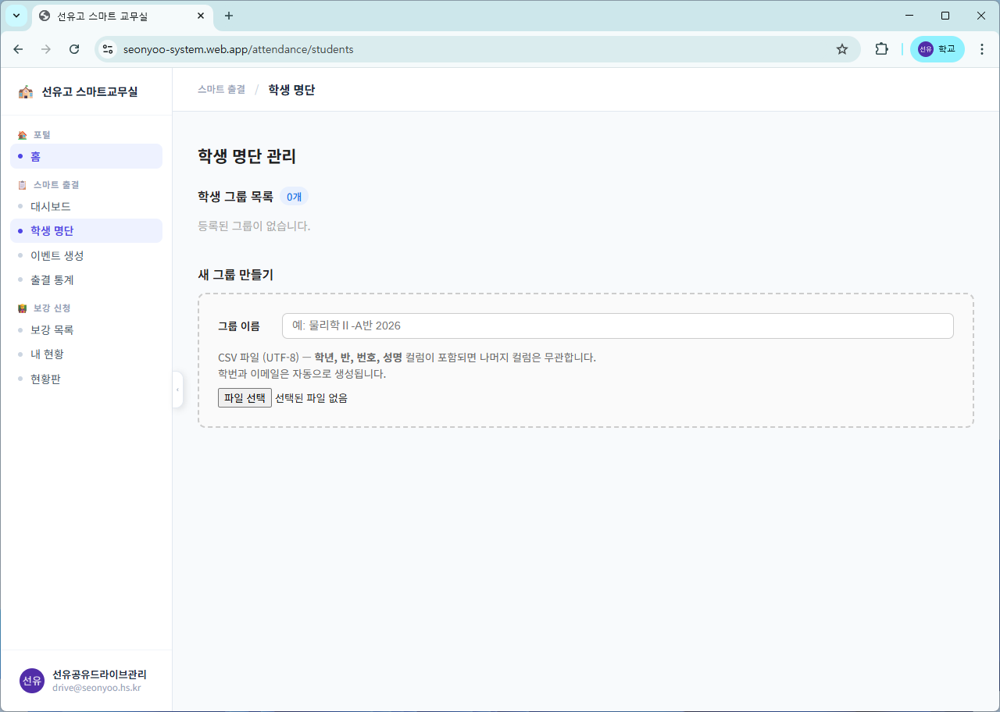
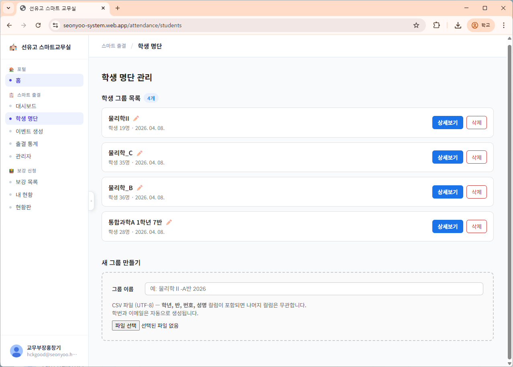
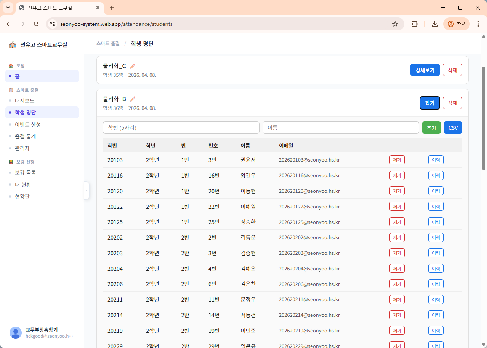
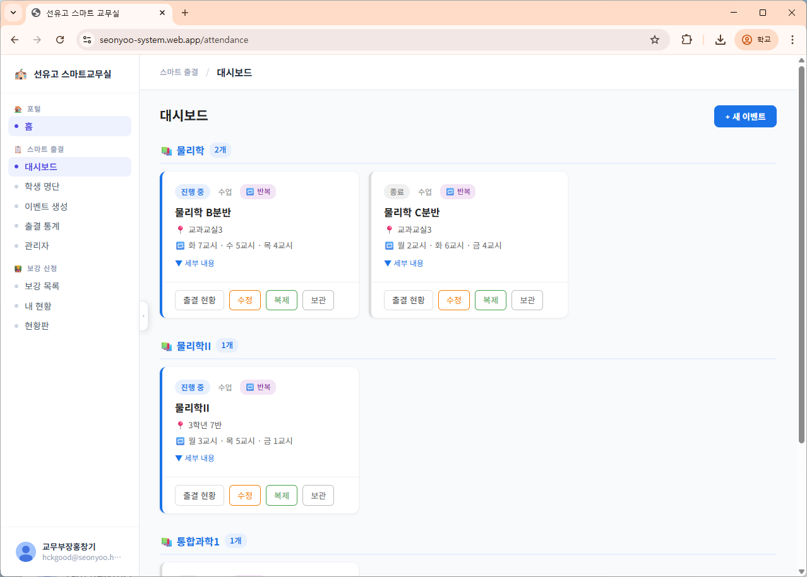
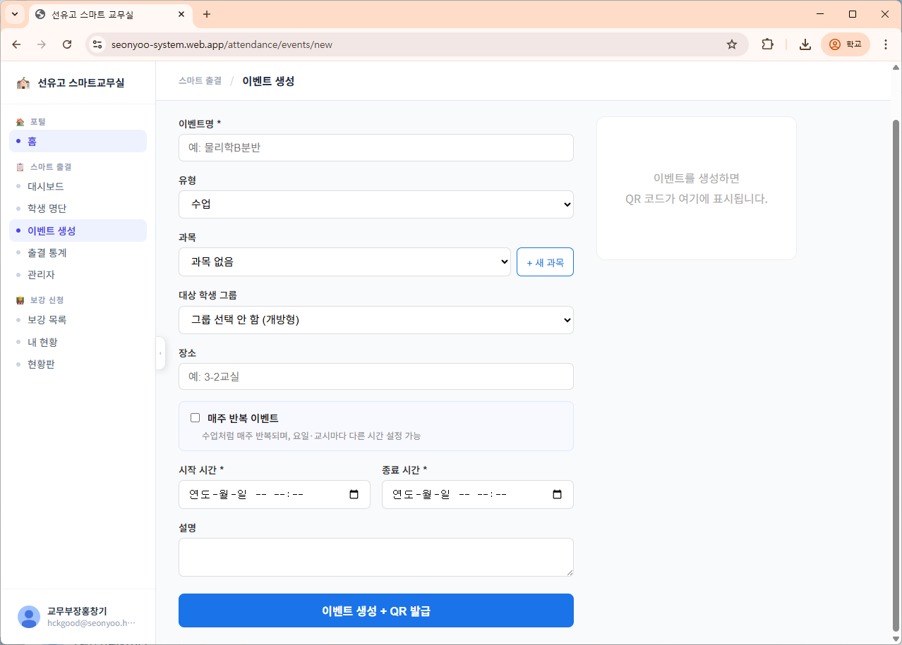
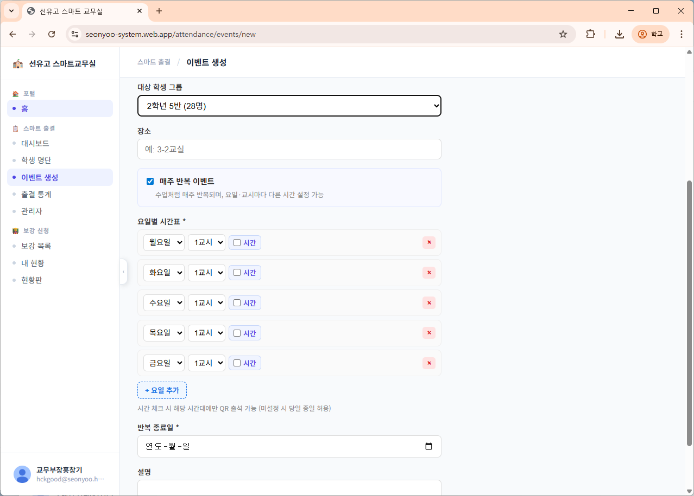

# 선유고 스마트 출결 시스템 매뉴얼
## 선택과목 담당교사용

> **이 매뉴얼 대상**: 본인이 직접 수강 학생 명단을 관리해야 하는 교사  
> (예: 물리학Ⅱ, 고급수학, 제2외국어 등 반 편성과 무관한 선택과목)

---

## 목차

1. [가입 및 로그인](#1-가입-및-로그인)
2. [학생 그룹 만들기](#2-학생-그룹-만들기)
3. [반복 이벤트 등록하기](#3-반복-이벤트-등록하기)
4. [수업 시작 — QR 출석 받기](#4-수업-시작--qr-출석-받기)
5. [출결 현황 확인](#5-출결-현황-확인)
6. [미출석 학생 처리](#6-미출석-학생-처리)
7. [과거 출결 기록 조회](#7-과거-출결-기록-조회)

---

## 1. 가입 및 로그인

### 1-1. 첫 접속 및 회원가입

접속 주소: **https://seonyoo-system.web.app**

1. **Google로 로그인** 버튼 클릭
2. 학교 Google 계정(`@seonyoo.hs.kr`)으로 로그인

> ⚠️ **처음 로그인 시 승인 대기 화면이 표시됩니다.**  
> 관리자(교무부장)에게 승인을 요청하세요. 승인 완료 후 사용 가능합니다.

### 1-2. 승인 완료 후 메인 화면

**스마트 출결 시스템** 카드를 클릭하여 진입합니다.

---

## 2. 학생 그룹 만들기

> 수강 학생 명단을 시스템에 등록하는 단계입니다.  
> **이벤트를 만들기 전에 반드시 완료해야 합니다.**

### 2-1. 학생 명단 관리 메뉴 진입

좌측 메뉴에서 **학생 명단** 클릭

### 2-2. CSV 파일 준비

CSV 파일에는 아래 컬럼이 반드시 포함되어야 합니다.

| 컬럼명 | 예시 |
|--------|------|
| 학년 | 3 |
| 반 | 2 |
| 번호 | 15 |
| 성명 | 홍길동 |

> 나이스(NEIS) → 학생부 → 학급 학생 명렬표 출력 후 CSV로 저장하면 됩니다.  
> 학번과 이메일은 시스템이 자동 생성합니다.

### 2-3. 그룹 생성

1. **그룹 이름** 입력 (예: `물리학Ⅱ-A반 2026`)
   - 연도를 포함하면 나중에 구분하기 쉽습니다
2. CSV 파일 선택 (파일 탐색기에서 준비한 파일 선택)
3. **저장** 버튼 클릭

> ✅ 저장 완료 시 "N명이 학생 레지스트리에 등록되고 그룹이 생성되었습니다." 메시지 확인

### 2-4. 학생 개별 추가/제거

CSV 업로드 후에도 **상세보기** 버튼으로 학생을 개별 추가하거나 제거할 수 있습니다.

---

## 3. 반복 이벤트 등록하기

> 수업을 시스템에 등록하는 단계입니다.  
> 매주 반복되는 수업은 **한 번만 등록**하면 자동으로 반복됩니다.

### 3-1. 이벤트 생성 메뉴 진입

대시보드 우측 상단의 **+ 새 이벤트** 버튼 클릭

### 3-2. 기본 정보 입력

| 항목 | 입력 예시 | 설명 |
|------|-----------|------|
| 이벤트명 | `물리학Ⅱ-A반` | 수업명 입력 |
| 유형 | `수업` | 드롭다운 선택 |
| 과목 | `물리학Ⅱ` | 없으면 `+ 새 과목`으로 추가 |
| 대상 학생 그룹 | `물리학Ⅱ-A반 2026` | 2단계에서 만든 그룹 선택 |
| 장소 | `3-2교실` | 선택 입력 |

### 3-3. 매주 반복 이벤트 설정

1. **매주 반복 이벤트** 체크박스 활성화
2. 수업 요일과 교시 추가
   - `+ 요일 추가`로 여러 요일 등록 가능
   - **시간** 체크 시 해당 시간대에만 QR 체크인 허용됨 (권장)
3. **반복 종료일** 설정 (학기 말 날짜 입력)

### 3-4. 이벤트 생성 완료

**이벤트 생성 + QR 발급** 버튼 클릭 → 이벤트가 생성되고 대시보드 카드에 표시됩니다.

> QR 코드가 이벤트에 연결됩니다. 이 QR은 수업마다 재사용합니다.

---

## 4. 수업 시작 — QR 출석 받기

### 4-1. 출결 대시보드 진입

대시보드 이벤트 목록에서 해당 수업의 **출결 현황** 클릭

### 4-2. 라이브 세션 시작

1. **출석 시작** 버튼 클릭 → QR 코드 활성화
2. QR 코드를 화면에 띄워 학생들이 스캔하도록 안내

> 학생은 본인 스마트폰으로 QR 스캔 → 자동 출석 처리됩니다.  
> 별도 앱 설치 불필요, 브라우저에서 바로 처리됩니다.

### 4-3. 실시간 출석 현황 확인

- 좌측: QR 코드 패널 (출석 일시 중지 / 재오픈 가능)
- 중앙: 출석 완료 학생 목록 (QR 체크인 시각 표시, 실시간 업데이트)
- 우측: 미출석 학생 목록

### 4-4. 출석 마감

수업 종료 후 QR 출석 패널 하단의 **출석 마감** 버튼 클릭 → QR 비활성화

---

## 5. 출결 현황 확인

- **출석**: QR 또는 수동으로 출석 처리된 학생
- **지각**: 설정 시간 이후 체크인한 학생
- **미출석**: 출석 기록 없는 학생
- **사유등록**: 결석 사유가 입력된 학생

---

## 6. 미출석 학생 처리

### 6-1. 수동 출석 처리

미출석 목록에서 실제 출석한 학생을 수동으로 처리할 수 있습니다.

### 6-2. 결석 사유 등록

미출석 학생 항목에서 해당하는 사유 버튼을 클릭한 후 **저장**합니다.

| 사유 | 설명 |
|------|------|
| 질병결석 | 아파서 결석 |
| 조퇴 | 일찍 귀가 |
| 지각 | 늦게 도착 |
| 미인정결석 | 결석 사유 인정 불가 |
| 체험학습 | 현장 체험학습 참여 |
| 기타 | 사유 직접 입력 |

---

## 7. 과거 출결 기록 조회

### 7-1. 달력으로 날짜 선택

출결 현황 화면 우측 상단 달력에서 조회할 날짜 클릭

- 수업이 있는 요일만 선택 가능 (다른 날짜는 비활성)
- 좌우 화살표로 월 이동

### 7-2. 해당 날짜 출결 기록 확인

날짜 클릭 시 해당 수업의 출결 내역이 표시됩니다.

---

## 자주 묻는 질문

**Q. 학생이 QR을 못 찍었을 때는?**  
A. 미출석 목록에서 해당 학생의 **수동 출석** 버튼으로 직접 처리하세요.

**Q. 학생 명단이 바뀌었을 때는?**  
A. 학생 명단 관리 → 그룹 상세보기에서 학생을 추가하거나 제거하세요.

**Q. 수업을 잘못 등록했을 때는?**  
A. 이벤트 목록에서 해당 수업의 **수정** 버튼으로 변경 가능합니다.

**Q. QR 코드를 분실했거나 보안이 우려될 때는?**  
A. 이벤트 수정에서 **QR 재발급** 기능을 사용하세요. 기존 QR은 즉시 무효화됩니다.
