# 선유고 스마트 출결 시스템 매뉴얼
## 전체·지정과목 담당교사용

> **이 매뉴얼 대상**: 학급 전체 또는 관리자가 지정한 학생 그룹을 그대로 사용하는 교사  
> (예: 국어, 수학, 영어 등 학급 단위로 진행되는 과목, 조회 담당교사)
>
> ✅ **학생 그룹은 관리자(교무부장)가 미리 만들어 공유해 둡니다. 직접 만들 필요 없습니다.**

---

## 목차

1. [가입 및 로그인](#1-가입-및-로그인)
2. [반복 이벤트 등록하기](#2-반복-이벤트-등록하기)
3. [수업 시작 — QR 출석 받기](#3-수업-시작--qr-출석-받기)
4. [출결 현황 확인](#4-출결-현황-확인)
5. [미출석 학생 처리](#5-미출석-학생-처리)
6. [과거 출결 기록 조회](#6-과거-출결-기록-조회)

---

## 1. 가입 및 로그인

### 1-1. 첫 접속 및 회원가입

접속 주소: **https://seonyoo-system.web.app**

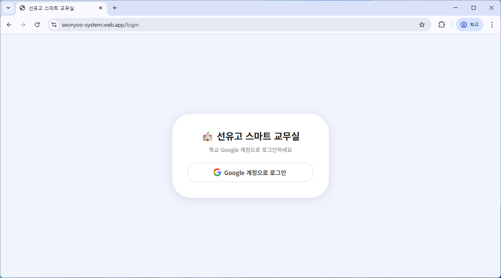

1. **Google로 로그인** 버튼 클릭
2. 학교 Google 계정(`@seonyoo.hs.kr`)으로 로그인

> ⚠️ **처음 로그인 시 승인 대기 화면이 표시됩니다.**  
> 관리자(교무부장)에게 승인을 요청하세요. 승인 완료 후 사용 가능합니다.

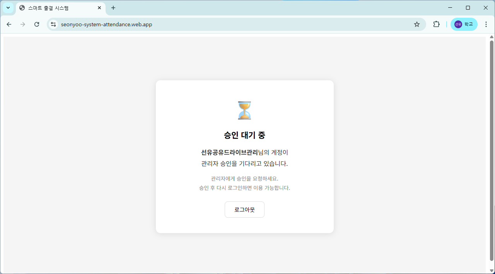

### 1-2. 승인 완료 후 메인 화면

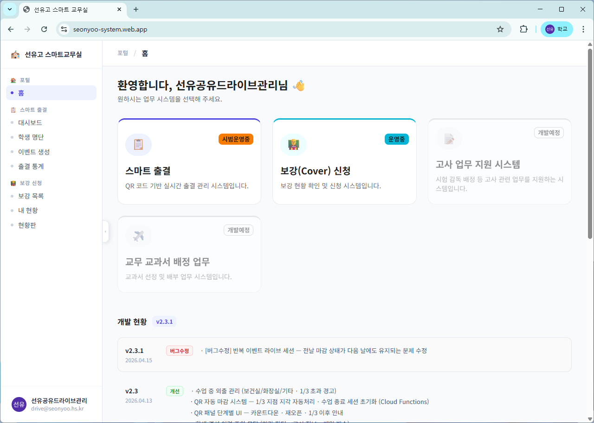

**스마트 출결 시스템** 카드를 클릭하여 진입합니다.

---

## 2. 반복 이벤트 등록하기

> 수업(또는 조회)을 시스템에 등록하는 단계입니다.  
> **학생 그룹은 관리자가 이미 만들어 두었으므로, 이벤트 생성만 하면 됩니다.**

### 2-1. 이벤트 생성 메뉴 진입

우측 상단 또는 대시보드의 **+ 이벤트 생성** 버튼 클릭

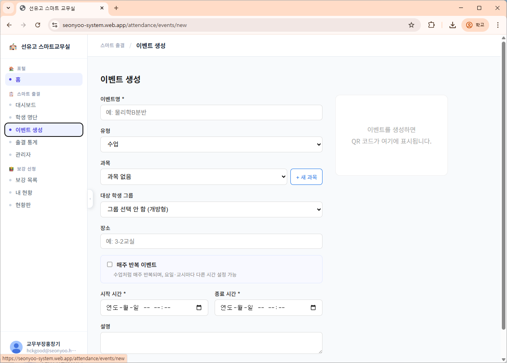

### 2-2. 기본 정보 입력

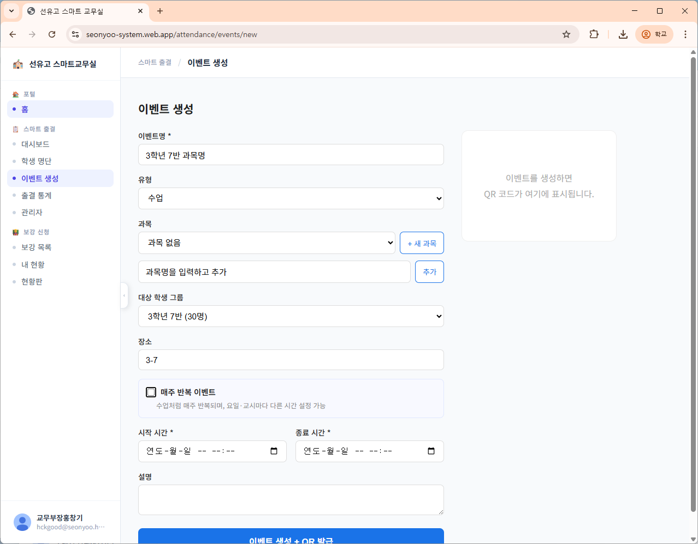

| 항목 | 입력 예시 | 설명 |
|------|-----------|------|
| 이벤트명 | `3학년 7반 국어` | 수업명 입력 |
| 유형 | `수업` | 드롭다운 선택 (조회는 `조회` 선택) |
| 과목 | `국어` | 없으면 `+ 새 과목`으로 추가 |
| 대상 학생 그룹 | `3학년 7반` | 목록에서 **공유** 배지가 붙은 그룹 선택 |
| 장소 | `3-7교실` | 선택 입력 |

### 2-3. 공유 그룹 선택 방법

학생 그룹 드롭다운에서 파란 **공유** 배지가 붙은 항목을 선택하세요.  
이 그룹은 관리자가 학급 전체 학생으로 구성해 공유한 명단입니다.

> ⚠️ **주의**: 같은 학급을 여러 교과 교사가 각자 이벤트로 등록해도 출결 기록은 이벤트별로 완전히 분리됩니다. 다른 선생님의 출결 기록에 영향을 주지 않습니다.

### 2-4. 조회 이벤트 전용 — 지각 기준 시간 설정

유형을 **조회**로 선택하면 지각 기준 시간 설정 항목이 나타납니다.

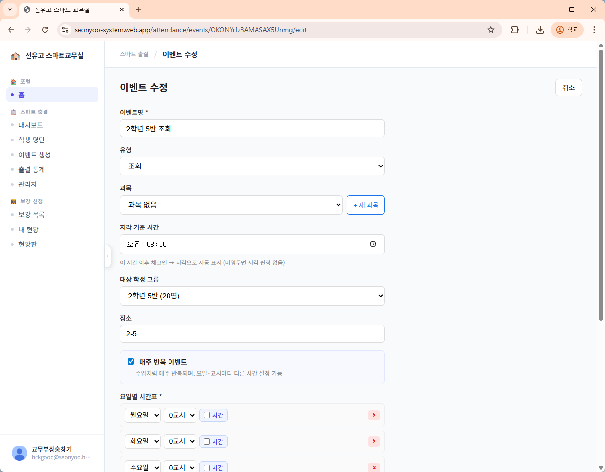

- 이 시간 이후 QR 체크인 → 자동으로 **지각** 표시
- 비워두면 지각 판정 없음

### 2-5. 매주 반복 이벤트 설정

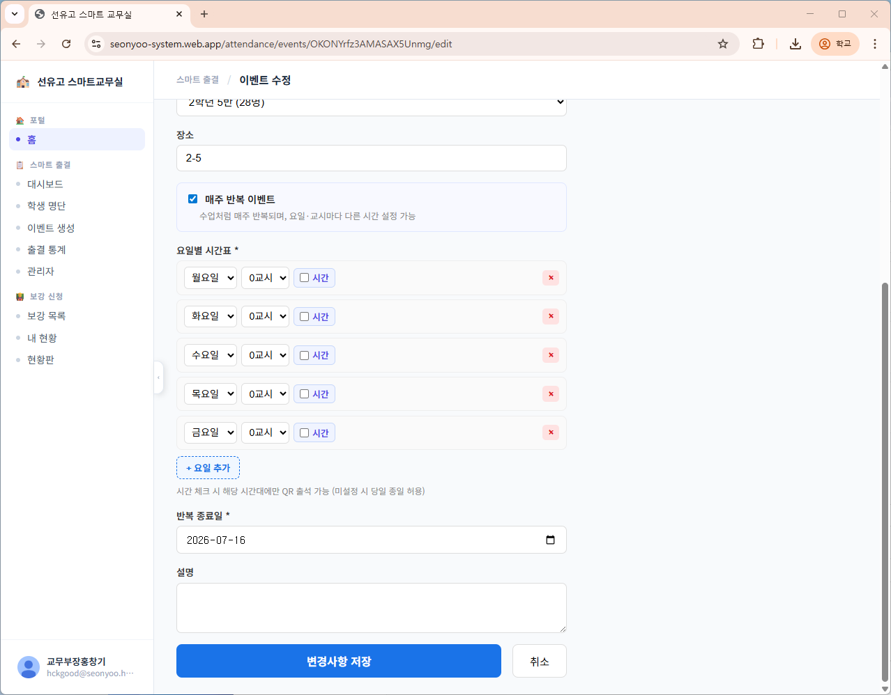

1. **매주 반복 이벤트** 체크박스 활성화
2. 수업 요일과 교시 추가
   - `+ 요일 추가`로 여러 요일 등록 가능
   - **시간** 체크 시 해당 시간대에만 QR 체크인 허용됨 (권장)
3. **반복 종료일** 설정 (학기 말 날짜 입력)

### 2-6. 이벤트 생성 완료

**이벤트 생성 + QR 발급** 버튼 클릭

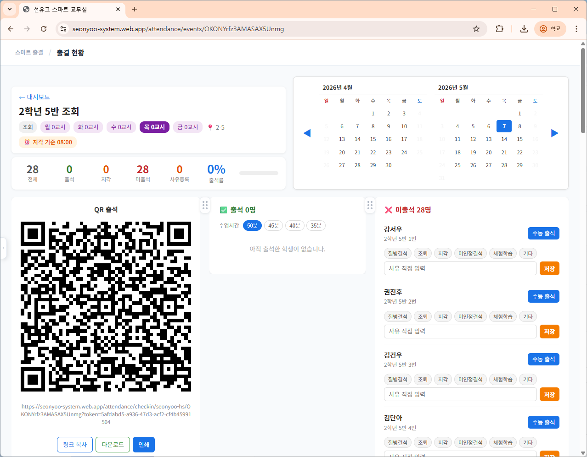

> QR 코드가 화면 오른쪽에 표시됩니다. 이 QR은 수업마다 재사용합니다.

---

## 3. 수업 시작 — QR 출석 받기

### 3-1. 출결 대시보드 진입

이벤트 목록에서 해당 수업 클릭

### 3-2. 라이브 세션 시작

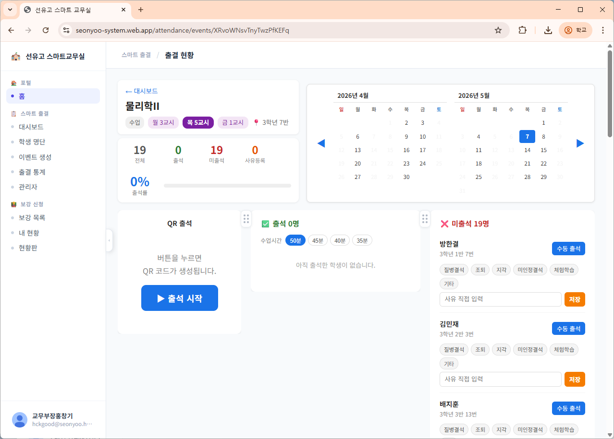

1. **출석 시작** 버튼 클릭 → QR 코드 활성화
2. QR 코드를 화면에 띄워 학생들이 스캔하도록 안내

> 학생은 본인 스마트폰으로 QR 스캔 → 자동 출석 처리됩니다.  
> 별도 앱 설치 불필요, 브라우저에서 바로 처리됩니다.

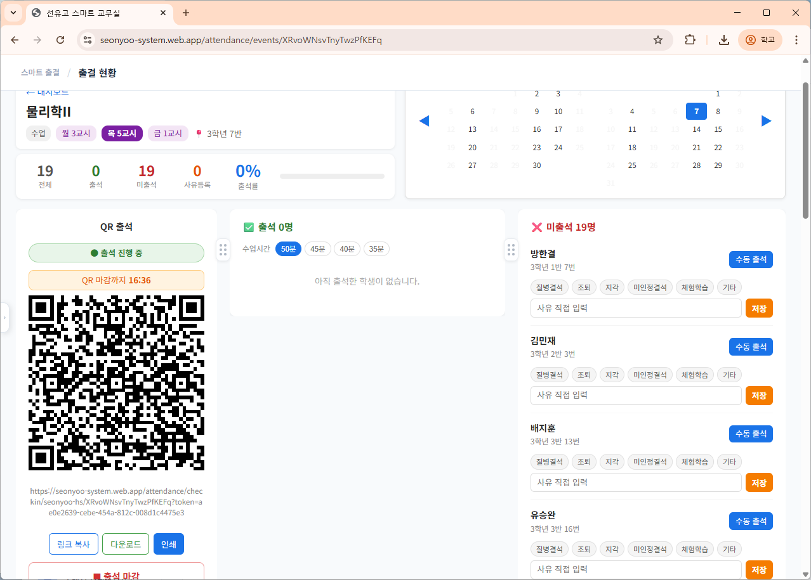

### 3-3. 실시간 출석 현황 확인

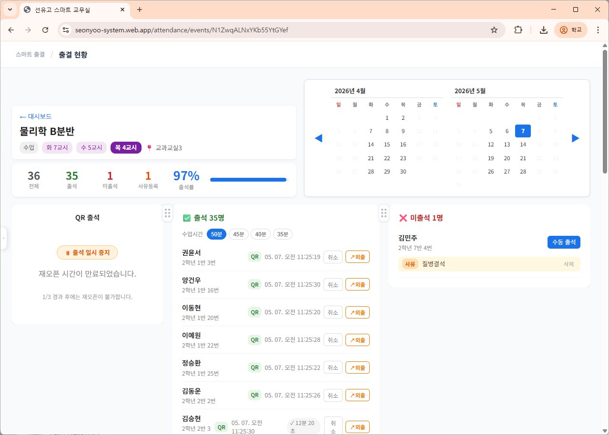

- 좌측: QR 코드 패널
- 중앙: 출석 완료 학생 목록 (실시간 업데이트)
- 우측: 미출석 학생 목록

### 3-4. 출석 마감

수업 종료 후 **출석 마감** 버튼 클릭 → QR 비활성화

---

## 4. 출결 현황 확인

- **출석**: QR 또는 수동으로 출석 처리된 학생
- **지각**: 설정 시간 이후 체크인한 학생 (조회 이벤트만 해당)
- **미출석**: 출석 기록 없는 학생

---

## 5. 미출석 학생 처리

### 5-1. 수동 출석 처리

미출석 목록에서 실제 출석한 학생을 수동으로 처리할 수 있습니다.

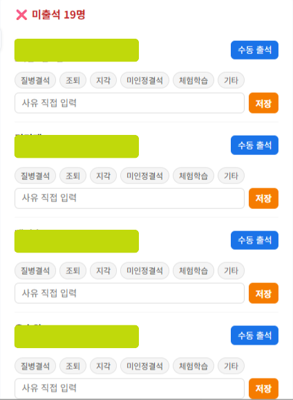

### 5-2. 결석 사유 등록

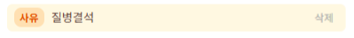

| 사유 | 설명 |
|------|------|
| 질병결석 | 아파서 결석 |
| 조퇴 | 일찍 귀가 |
| 지각 | 늦게 도착 |
| 직접 입력 | 기타 사유 |

---

## 6. 과거 출결 기록 조회

### 6-1. 달력으로 날짜 선택

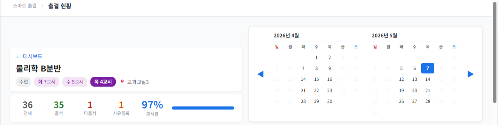

- 수업이 있는 요일만 선택 가능 (다른 날짜는 비활성)
- 좌우 화살표로 월 이동

### 6-2. 해당 날짜 출결 기록 확인

날짜 클릭 시 해당 수업의 출결 내역이 표시됩니다.

---

## 자주 묻는 질문

**Q. 학생 그룹 드롭다운에 우리 반이 안 보일 때는?**  
A. 관리자(교무부장)에게 해당 학급 공유 그룹 생성을 요청하세요.

**Q. 학생이 QR을 못 찍었을 때는?**  
A. 미출석 목록에서 해당 학생의 **수동 출석** 버튼으로 직접 처리하세요.

**Q. 같은 학급을 담당하는 다른 선생님의 출결에 영향이 가지는 않나요?**  
A. 이벤트별로 출결 기록이 완전히 분리되므로 서로 영향 없습니다.

**Q. 수업을 잘못 등록했을 때는?**  
A. 이벤트 목록에서 해당 수업의 **수정** 버튼으로 변경 가능합니다.
